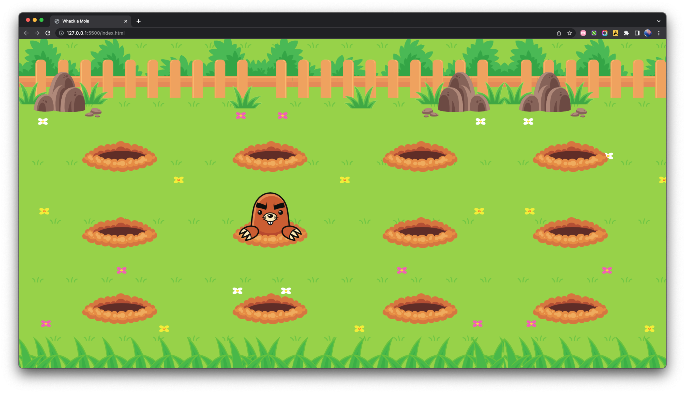

🇺🇸
## 💻 PROJECT
This is the initial fase of a Whack a Mole game, based on a layout provided by Rocketseat.
I was supposed to develop the desktop version of the game using @keyframes and display grid or flex. I chose to use display grid because I think it's faster to set it up.

## 🚀 TECH
This project was developed using the following technologies:
- HTML
- CSS
- Git e GitHub
- Figma

## 🖌 LAYOUT
You can check out the original layout [clicking here](https://www.figma.com/file/jhJYX6j1OzJLGksnbEKIZV/Wack-a-Mole-(Community)-(Copy)?type=design&node-id=0%3A1&mode=dev).
 

 

🇧🇷
## 💻 PROJETO
Essa é a fase inicial de um jogo do tipo Jardim das Toupeiras, baseado em um layout fornecido pela Rocketseat.
Eu devia desenvolver a versão desktop do jogo utilizando @keyframes e display grid ou flex. Eu escolhi usar o display grid, pois acredito ser mais rápido de cofigurar.

## 🚀 TECNOLOGIAS
Este projeto foi desenvolvido utilizando as seguintes tecnologias:
- HTML
- CSS
- Git e GitHub
- Figma

## 🖌 LAYOUT
Você pode conferir o layout original [clicando aqui](https://www.figma.com/file/jhJYX6j1OzJLGksnbEKIZV/Wack-a-Mole-(Community)-(Copy)?type=design&node-id=0%3A1&mode=dev).

 

 
